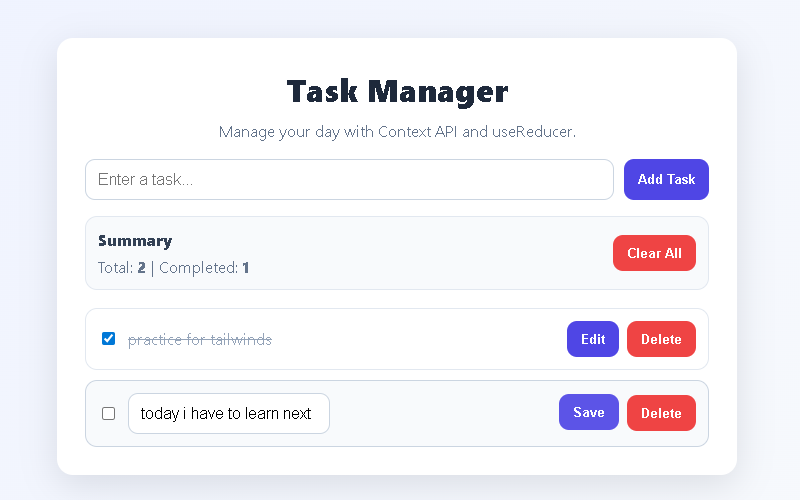
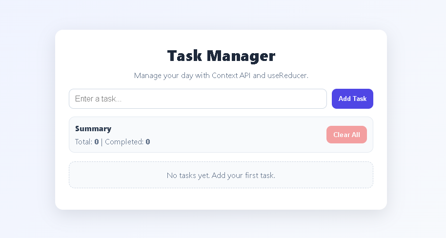

# Task Manager Application



A clean and scalable Task Manager app built with **React Context API** and **useReducer**.

This project demonstrates global state management without prop-drilling, and includes full task operations: add, edit, toggle complete, delete, and clear all tasks.

---

## Features

- Add new tasks
- Mark tasks as complete/incomplete
- Edit task title inline
- Delete single task
- Clear all tasks
- Live summary (total tasks + completed tasks)
- Responsive UI with transitions and hover effects
- Completed tasks are visually greyed out

---

## Tech Stack

- React 18
- Context API
- useReducer
- CSS3
- Create React App

---

## Project Architecture

The app follows separation of concerns:

- **Reducer** handles all task state transitions
- **Context Provider** exposes global state and dispatch
- **Components** handle UI rendering and dispatch actions

### State Shape

```js
{
  tasks: [
    {
      id: number,
      title: string,
      completed: boolean
    }
  ]
}
```

### Supported Actions

- `ADD_TASK`
- `TOGGLE_TASK`
- `EDIT_TASK`
- `DELETE_TASK`
- `CLEAR_TASKS`

---

## Folder Structure

```bash
task-manager/
├── public/
├── src/
│   ├── components/
│   │   ├── TaskInput.js
│   │   ├── TaskItem.js
│   │   ├── TaskList.js
│   │   └── TaskSummary.js
│   ├── context/
│   │   └── TaskContext.js
│   ├── reducer/
│   │   └── taskReducer.js
│   ├── App.js
│   ├── App.css
│   ├── index.js
│   └── index.css
├── package.json
└── README.md
```

---

## Setup Instructions

### 1) Clone the repository

```bash
git clone <your-repo-url>
cd react-essentials-assignment/task-manager
```

### 2) Install dependencies

```bash
npm install
```

### 3) Run the app

```bash
npm start
```

Open [http://localhost:3000](http://localhost:3000).

---

## Available Scripts

- `npm start` - Run development server
- `npm test` - Run test suite
- `npm run build` - Build production bundle

---

## Assignment Requirements Covered

### 1. Context API Setup
- Global `TaskContext` created
- Entire app wrapped using `TaskProvider`
- Initial global state prepared in provider

### 2. useReducer Implementation
- Reducer logic implemented with action-based updates
- Full switch-case action handling

### 3. Components
- `TaskInput` for adding tasks
- `TaskList` for rendering task collection
- `TaskItem` for toggle/edit/delete controls
- `TaskSummary` for total/completed overview and clear action

### 4. Integration Flow
- All changes flow through `dispatch -> reducer -> global state -> UI`
- Real-time UI updates with no prop drilling

### 5 & 6. CSS Styling
- Centered main layout and polished card container
- Interactive hover and focus effects
- Completed-task visual treatment
- Styled action buttons
- Responsive behavior for mobile layouts
- Smooth transitions for better UX

---

## Screenshots

Add your final UI screenshots in this section before submission.

Suggested:
- Main task dashboard
- Task list with completed + pending tasks
- Mobile responsive view

---

## Submission Checklist

- [ ] Public GitHub repository named **react-essentials-assignment**
- [ ] Full `src/` folder with components, context, reducer, styles
- [ ] Updated `README.md` with project details
- [ ] Final UI screenshots attached in repository

---

## Author

Built for the React Essentials assignment using Context API and useReducer.
